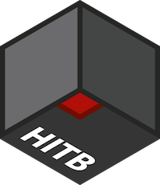
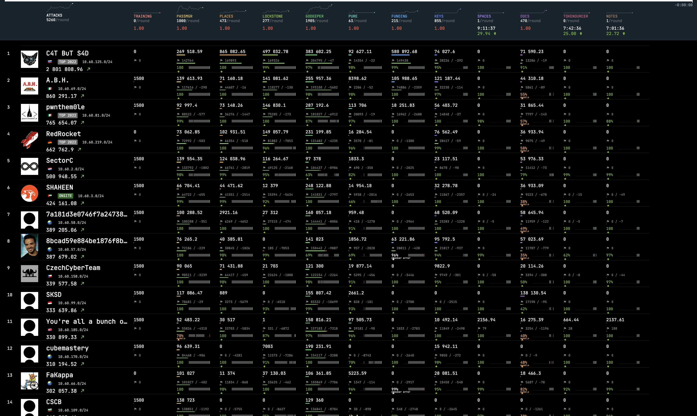

#  HITB SECCONF CTF 2023

HITB SECCONF CTF is an onsite + online international challenge in information security. Developed by Hackerdom team for HITB SECCONF in Phuket, Thailand. [HITB SECCONF CTF 2023](https://ctftime.org/event/2037/) was held on August 24–25th, 2023.

The contest is driven by almost classic rules for Attack-Defense [CTF](https://en.wikipedia.org/wiki/Capture_the_flag_%28cybersecurity%29). Each team is given a set of vulnerable services.
Organizers regularly fill services with private information — the flags.
The goal of each team is to find vulnerabilities, fix them in their services and exploit them to get flags from other teams.

You can read the details on the official contest website: https://ctf.hackerdom.ru/hitb-ctf-phuket-2023/.

Official conference website: https://conference.hitb.org/hitbsecconf2023hkt/.

# This Repository Contains

* sources of all services in the folder [services/](services/)
* checkers for the [checksystem](https://github.com/Hackerdom/checksystem) in the folder [checkers/](checkers/)
* ... and configuration for it in [cs/](cs/)
* exploits for all services in the folder [sploits/](sploits/)
* writeups with vulnerabilities and exploitation description for all services in folder [writeups/](writeups/)

Also, we're happy to share with you some of our internal infrastructure magic:
* CI/CD for Digital Ocean's images services' packing and proxies deploying. See [vuln_images/](vuln_images/) and [.github/workflows/](.github/workflows)
* our CTF Cloud and VPN Infrastructure in [ansible/](ansible/)

All materials are licensed under the [MIT License](LICENSE).

# Final Scoreboard

Congratulations for 🇷🇺 C4T BuT S4D for the first place!

Second place: 🇮🇹 A.B.H.

Third place: 🇮🇹 pwnthem0le

# Services

| Service | First Blood Team | Lang / Framework | Checker | Sploit | Writeup | Author |
| ------- | ---------------- | ---------------- | ------- | ------ | ------- | ------ |
| [docs](/services/docs/) | [SKSD](https://ctftime.org/team/211952) | Ruby, Python, PostgreSQL | [🔗︎](/checkers/docs/) | [🔗︎](/sploits/docs/) | [🔗︎](/writeups/docs/) | [and](https://github.com/avkhozov) |
| [funding](/services/funding/) | [C4T BuT S4D](https://ctftime.org/team/83435) | Ethereum, Node.js | [🔗︎](/checkers/funding/) | [🔗︎](/sploits/funding/) | [🔗︎](/writeups/funding/) | [andgein](https://github.com/andgein) |
| [godeeper](/services/godeeper/) | [SKSD](https://ctftime.org/team/211952) | Python | [🔗︎](/checkers/godeeper/) | [🔗︎](/sploits/godeeper/) | [🔗︎](/writeups/godeeper/) | [awengar](https://github.com/awengar) |
| [keys](/services/keys/) | [ECQ-B](https://ctftime.org/team/264945) | PHP | [🔗︎](/checkers/keys/) | [🔗︎](/sploits/keys/) | [🔗︎](/writeups/keys/) | [znick](https://github.com/znick) |
| [lockstone](/services/lockstone/) | [C4T BuT S4D](https://ctftime.org/team/83435) | Javascript, GraphQL, Node.js | [🔗︎](/checkers/lockstone/) | [🔗︎](/sploits/lockstone/) | [🔗︎](/writeups/lockstone/) | [bay](https://github.com/alexbers) |
| [notes](/services/notes/) | [You're all a bunch of fucking skids](https://ctftime.org/team/264943) \* | PHP | [🔗︎](/checkers/notes/) | [🔗︎](/sploits/notes/) | [🔗︎](/writeups/notes/) | [hx0day](https://github.com/hx0day) |
| [passmgr](/services/passmgr/) | [C4T BuT S4D](https://ctftime.org/team/83435) | Go, PostgreSQL | [🔗︎](/checkers/passmgr/) | [🔗︎](/sploits/passmgr/) | [🔗︎](/writeups/passmgr/) | [dimmo](https://github.com/dimmo) |
| [places](/services/places/) | [C4T BuT S4D](https://ctftime.org/team/83435) | Go, SQLite | [🔗︎](/checkers/places/) | [🔗︎](/sploits/places/) | [🔗︎](/writeups/places/) | [dscheg](https://github.com/dscheg) |
| [pure](/services/pure/) | [pwnthem0le](https://ctftime.org/team/60467) | Javascript, Node.js, Express.js | [🔗︎](/checkers/pure/) | [🔗︎](/sploits/pure/) | [🔗︎](/writeups/pure/) | [art](https://github.com/ar7z1) |
| [spaces](/services/spaces/) | [You're all a bunch of fucking skids](https://ctftime.org/team/264943) \* | C# .NET, websockets | [🔗︎](/checkers/spaces/) | [🔗︎](/sploits/spaces/) | [🔗︎](/writeups/spaces/) | [dscheg](https://github.com/dscheg) |
| [tokenourcer](/services/tokenourcer/) | [You're all a bunch of fucking skids](https://ctftime.org/team/264943) \* | Python, nginx | [🔗︎](/checkers/tokenourcer/) | [🔗︎](/sploits/tokenourcer/) | [🔗︎](/writeups/tokenourcer/) | [werelaxe](https://github.com/werelaxe) |

\* Service vulnerabilities were not used

# Authors

This CTF is brought to you by these amazing guys:

* [Alexander Bersenev](https://github.com/alexbers) aka `bay`, the author of the service `lockstone`, also our Cloud and VPN master
* [Andrey Gein](https://github.com/andgein) aka `andgein`, the author of the service `funding`, also our teamleader, DevOps and support for teams
* [Andrey Khozov](https://github.com/avkhozov) aka `and`, the author of the service `docs`, also our checksystem master
* [Artem Deikov](https://github.com/hx0day) aka `hx0day`, the author of the service `notes`
* [Artem Zinenko](https://github.com/ar7z1) aka `art`, the author of the service `pure`
* [Artur Khanov](https://github.com/awengar) aka `awengar`, the author of the service `godeeper`
* [Daniil Sharko](https://github.com/werelaxe) aka `werelaxe`, the author of the service `tokenourcer`
* [Dmitry Simonov](https://github.com/dimmo) aka `dimmo`, the author of the service `passmgr`
* [Dmitry Titarenko](https://github.com/dscheg) aka `dscheg`, the author of services `places` and `spaces`
* [Konstantin Plotnikov](https://github.com/kostteg) aka `kost`, our project manager
* [Nikolay Zhuravlev](https://github.com/znick) aka `znick`, the author of the service `keys`

If you have any question about services, platform or competition 
write us an email to [info@hackerdom.ru](mailto:info@hackerdom.ru) or [ctf@hitb.org](mailto:ctf@hitb.org).

© 2023 [HackerDom](http://hackerdom.ru)
