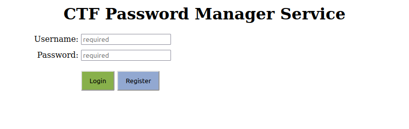
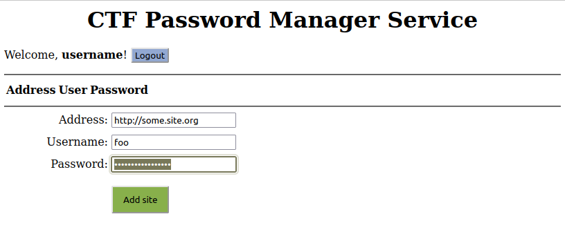
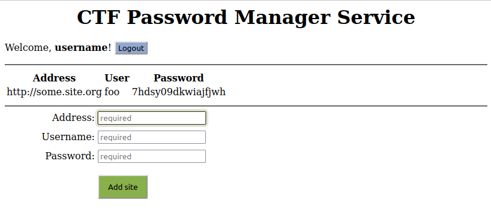

# passmgr

## Description

`passmgr` is a web-service written in Golang. Source code is given. 

The service allows you to register (with `login` and `password`), then log in. 

After logging in, you can manage (add, view) your private list of passwords.

## Flags

Flag ID is the username, flag is the password for some website.

## Research

The service has not so many files to research:

    $ ls -1
    db.go
    docker-compose.yml
    Dockerfile
    go.mod
    go.sum
    index.go
    index.go.html
    main.go
    util.go

From `docker-compose.yaml` we can learn, that service consists of two docker containers: the database and the application. 
The application container listens to 80 port. 

In `db.go` file there are database models and code to connect to the database.

### Database structure

Table "public.records":

   Column   |           Type           | Collation | Nullable |               Default               
------------|--------------------------|-----------|----------|-------------------------------------
 id         | bigint                   |           | not null | nextval('records_id_seq'::regclass)
 created_at | timestamp with time zone |           |          | 
 updated_at | timestamp with time zone |           |          | 
 user       | character varying(64)    |           |          | 
 pass       | character varying(64)    |           |          | 
 site       | character varying(64)    |           |          | 
 user_ref   | character varying(64)    |           |          | 

Table "public.sessions":

   Column   |           Type           | Collation | Nullable |               Default                
------------|--------------------------|-----------|----------|--------------------------------------
 id         | bigint                   |           | not null | nextval('sessions_id_seq'::regclass)
 created_at | timestamp with time zone |           |          | 
 updated_at | timestamp with time zone |           |          | 
 cookie     | character varying(64)    |           |          | 
 user       | character varying(64)    |           |          | 

In `index.go.html` and `index.go` we see template for the response web page and model for it.

In `util.go` there are some helper functions to manage environment variables, cookies and random strings.

These files contain no (known) vulnerabilities.

The most important file is `main.go`, it contains http handlers and the logic of the service.

The first table, `records`, contain both `user/pass` pairs for logging in, and `user/pass` pairs stored in the private area, 
they are distinguished by the `user_ref` field:

 id  |   user   |               pass                |             site              | user_ref 
-----|----------|-----------------------------------|-------------------------------|----------
   1 | a164u8x3 | e8s1cmgboqjo                      |                               | 
   2 | a164u8x3 | FFFFFFFFFFFFFFFFFFFFFFFFFFFFFFFF= | https://www.fydu.3kauixaw.com | a164u8x3

Here,

* `a164u8x3 / e8s1cmgboqjo` is a login and password to log in (`user_ref` is empty),
* `a164u8x3 / FFFFFFFFFFFFFFFFFFFFFFFFFFFFFFFF= / https://www.fydu.3kauixaw.com` is a private info for the user (`user_ref` is non-empty).

We can't log in as `a164u8x3 / FFFFFFFFFFFFFFFFFFFFFFFFFFFFFFFF=`, because in `func handleLogin()` there is a check:

    :::go
    result := db.Where("\"user\" = ? AND pass = ? AND user_ref = ''", user, password).Find(&record)

The second table, `sessions`, contains logged-in users sessions,

 id  |              cookie              |   user   
-----|----------------------------------|----------
 413 | BhfENBVRQfrqGHSnXvAmfTtBTWQeEcBy | postgres

There is a logical error in `func handleAdd()`. This functions adds user/pass/site record for the logged-in user.
If `ctf` cookie is set, but session is not found in the DB, `result.Error` will be `nil` (DB query completed 
successfully). The service doesn't check `result.RowsAffected` (if any session was found), so a new record will 
be created with empty `user_ref`. The database doesn't prohibit to add several records for the same `user`. So, 
we can add the second password for existing user and log in with both passwords! After logging in, we can see the 
private info (flag).

    :::go
    func handleAdd(c *gin.Context) {
            ...
            
            cookieValue, err := c.Cookie(cookieName)
            if err != nil || len(cookieValue) == 0 {
                    c.Redirect(http.StatusFound, "/")
                    return
            }
    
            var session Session
            result := db.Where("cookie = ?", cookieValue).Find(&session)
            if result.Error != nil {                                  // BUG IS HERE
                    c.HTML(http.StatusOK, template, gin.H{})
                    return
            }
    
            result = db.Create(&Record{
                    User:    user,
                    Pass:    password,
                    Site:    address,
                    UserRef: session.User,
            })
            
            ...
    }

## Exploit

The main idea is to add second password for existing user:

`curl https://passmgr.team<N>.ctf.hitb.org/add -d "address=nonce&user=<USER>&password=<PASSWORD>" --cookie "ctf=nonce"`

Full exploit can be found [here](../../sploits/passmgr/exploit.sh).
