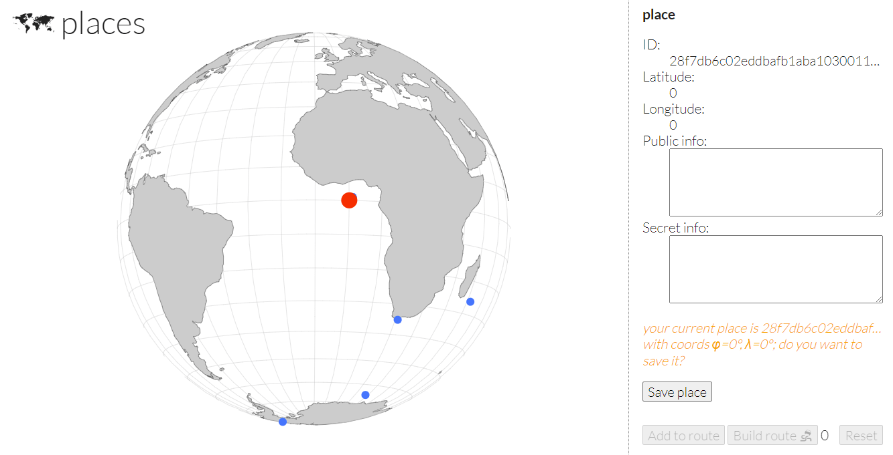
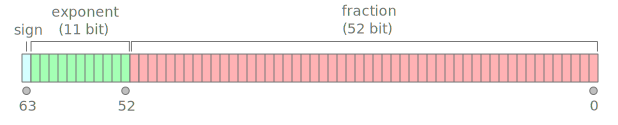

# places

**places** is a service for saving information about beautiful places and building routes wich includes several places to visit



List of available endpoints:
* `/api/auth?lat=LATITUDE&long=LONGITUDE` - set JWT cookie with random user ID, return place ID with passed coordinates;
* `/api/get/place/:id` - info about place by place ID;
* `/api/put/place[/:id]` - create place or update info about place by ID;
* `/api/list` - last 30 place IDs with coords;
* `/api/route` - route (places info in some order) with info about up to 9 places, you can use other users' places to make a route;

Place info is a struct contains coords (two `float64` values), public and secret string fields:
```go
type PlaceInfo struct {
	Lat    float64
	Long   float64
	Public string
	Secret string
}
```

Each place is identified by a hex string with 64 chars. Checksystem stores flags in the `Secret` field. Service returns `Secret` field value only for an author of the place
(user ID in JWT token cookie must be the same as a user ID stored in a place ID).

## Vuln

Place ID is an serialized and AES-128-ECB-encrypted struct with coords (two `float64`) and user ID:
```go
type PlaceId struct {
	UserId uuid.UUID
	Lat    float64
	Long   float64
}
```

Place ID is not MAC'ed in any way, so it is not protected against bit flipping (changing some bytes of a ciphertext in order to manipulate the plaintext bytes).
So an attacker can change the 128 bit suffix of the place ID which leads to some random change of the 128 bit block with `float64` coordinates of the place.
Note, that changing the prefix does not lead to any consequences that are interesting from a practical point of view, since the identifier changes unpredictably
and the 128 bits of the ID is too much to brute force it.

To build a route service sorts place IDs and then merges coordinates decrypted from place ID and information from a database stored by that place ID.
To optimize a number of requests to a database **places** uses `SELECT ... WHERE ... IN` statement with an array of passed place IDs.
The most interesting part here is a merging algorithm of the results from a database and the results from decryption process:
https://github.com/HITB-CyberWeek/hitbsecconf-ctf-2023/blob/afb2458ab7e904e44f481848342290ef002afb27/services/places/main.go#L269
GoLINQ's ZipT function is used to merge the results which simply combines elements of two arrays by their index.

If we somehow shift the elements of the arrays relative to each other, we will be able to get a secret for a others' place.
The easiest way to shift the results is to pass a place which is not saved in the database, howhever some checks of lengths of the arrays makes this impossible:
we need arrays of places after processing to be the same size.

Note that when forming arrays which are then merged, different representations of floating point numbers are used.
Place ID used for DB search unique results contains bit representations `float64` values (serialized and encrypted) whereas after decryption place IDs are distincted by golang structs.

So this is where the [IEEE-754](https://en.wikipedia.org/wiki/IEEE_754) comes into play.

## IEEE-754

The questions are:
1. Are there two such floating point numbers which are different by bit representations whereas are the same by `float64` comparison?
2. Are there two such floating point numbers which are the same by bit representations whereas are defferent by `float64` comparison?



Answer:
1. `+0.0 == -0.0`, but `+0.0` is represented as `0000..000` (64 zero bits) zero bits whereas `-0.0` is represented as `1000..000` (63 zero bits);
2. `float64` `NaN` never equals `NaN` even with the same bits;

So DistinctT() must collapse `+0.0` and `-0.0` and must not collapse `NaN` and `NaN` with the same bit representation.
And distinct by hex string representation must not collapse `+0.0` and `-0.0` and must collapse `NaN`s with the same bit representation.

So we need to create 3 places: `+0.0`, `-0.0`, `NaN`. `+0.0` and `-0.0` are allowed to be passed through JSON encoder, howhever `NaN` - is not allowed.

Luckily place ID is encrypted with AES-128-ECB and not MAC'ed, so we can use `/api/get/place/:id` (which not require place to be saved in DB) to brute force place ID suffix
in order to get decrypted value representing `NaN` which is `s111..111fff..fff` (any sign bit, 11 bits of exponent set to 1, any fraction bits).
In average we need 1024 attempts and after brute forcing we can update the non existing point by using `/api/put/place/:id` (which implemented as database upsert)
to save `NaN` value in the database.

Also we need to take into account that an attempt to encode a `NaN` value as JSON in standard golang package leads to an error (`500 Internal Server Error` on `/api/get/place/:id`).
Howhever `/api/route` uses streaming response, so if the part of the reponse with flag is already written then any subsequent errors are not a problem for us.

Also note that arrays before merge are ordered by place ID lexicographically, so we need register user with ID lexicographically after AES-128-ECB large enough
so created places with `NaN` to be ordered at the end of the route.

## Putting it all together

1. Brute force `/api/auth` to get lowest and highest ordered places in most cases
2. Create two places with one coordinate set to `+0.0` and `-0.0` with lowest ordered auth
3. Brute force `NaN` place (awaiting `500 Internal Server Error` status code) with highest ordered auth, also create some random place before `NaN`

In such exploitation places in the route will be ordered as follows:

  P1  |  P2  |  P3  |  P4  |  P5  |  P6  
------|------|------|------|------|------
 +0.0 | -0.0 | FLAG | Some |  NaN |  NaN 

And that's how the merge process looks like, note that arrays of places unique by corresponding `float64` representations are the same:

 Operation       |  P1  |  P2  |  P3  |  P4  |  P5  | Data Type                        
-----------------|------|------|------|------|------|----------------------------------
 linq.Distinct() | +0.0 | FLAG | Some |  NaN |  NaN | User ID and coords               
 SELECT ... IN   | +0.0 | -0.0 | FLAG | Some |  NaN | Public and Secret fields from DB 
 HTTP Response   | +0.0 | -0.0 | FLAG |  ERR |  ERR | Resulting merged place info      

As a result only three places are written to the response and the thrid one contains `Secret` field with FLAG, because access rights are checked against `Some`
place ID and not the `FLAG` place data from DB. This is only the one example of exploitable places order there are also other route examples usable for exploitation.

`+0.0`, `-0.0` and `NaN` places and corresponding cookies can be reused to build multiple routes so no need to brute force places on each round.

You can see full exploit here: [EXPLOIT](../../../../blob/main/sploits/places/Program.cs)
