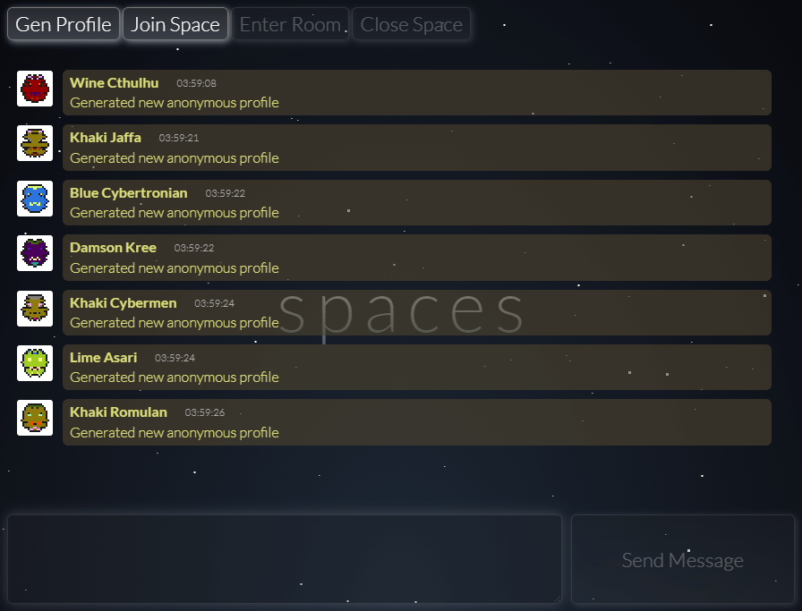

# spaces

**spaces** is the service with anonymous chat spaces and subspaces

API of the service implemented on websockets, available commands:

* `Generate` - generate random avatar and name before joining space;
* `Join` - join space with specified ID or generate a new random one;
* `Room` - enter a room with specified NANE in current space or leave to space root;
* `Close` - close a space to make it private for current participants, no new members are allowed from this moment;
* `Msg` - broadcast a message to all users which are currently in the same space/room;

User can regenerate a random profile before joining any space. After joining all the participants any member can close the space,
and from this moment no new members can join the closed space and read messages. Current user's space and room are persisted to
the disk, after F5 space and room are read from disk by user's auth and the first and last 3 messages are shown.

## Vuln (tldr)

1. Thread unsafe `Random` instance which can be broken to generate zero space ID
2. Zero space ID encoded as empty string not `1` (Base58 zero) and serialized values not padded by `1`
3. Empty encoded space ID leads to traversing path to root `data/` folder, which allows to create space using `Room` command
4. Base58 implementation is vulnerable to integer overflow on long Base58 strings, which allows to create conflicting space
5. Space open/closed validation use user passed string not Int64 decoded Base58 value, so conflicting space instead of real can be used to join

So, the exploitation plan is:

1. Break `Random` instance with large number of `Generate` requests
2. Generate new random space, which will be `0` (an empty string after Base58 encoding) becauses of broken `Random`
3. Create a room with long crafted Base58 string which leads to integer overflow on space ID decoding
4. Save current cookies to reuse websocket connection with saved state with space ID equal `0`
5. Use the second websocket with crafted Base58 string to join the space and bypass space access checks

## Details

For generation random profile used a signle instance of thread unsafe PRNG without locks. This instance is also used to 
generate random space ID. The old seeded .NET PRNG implementation uses an [LCG](https://en.wikipedia.org/wiki/Linear_congruential_generator),
this implementation has two counters, and unsynced usage of this instance from multiple threads leads to highly likely
stable state when both counters become equal. In this state `Random` instance generates only zeros.

Web socket messages are processed in [multithreaded manner](https://github.com/HITB-CyberWeek/hitbsecconf-ctf-2023/blob/a039d2104339867be7902a7b4962c4fc37db3780/services/spaces/src/WsHandler.cs#L53),
so if the attacker send many commands on generating random profile without awaiting response message from server,
it is highly likely that `Random` instance will be broken.

Space ID is a Base58-encoded Int64 random number. Broken `Random` instance generates only zeroes, and zero encoded as Base58
by **spaces** implementation of Base58 becomes an [empty string](https://github.com/HITB-CyberWeek/hitbsecconf-ctf-2023/blob/350cfea92f90658623a1533504a0a160be61e0ff/services/spaces/src/Base58.cs#L17).
**spaces** uses diretory structure and files as a storage, all messages of some space are the files inside the directory with
Base58-encoded space ID value. But `Path.Combine` which used to form a path to files skips empty segments of the path. So if
broken `Random` instance is used to generate space ID, the base folder for this space ID is the `data/` forder. This allows
to manipulate spaces as the rooms which in normal situation lie inside the space base folder.

But the room name validation does not allow us to enter any space as a room from `data/` forlder to read all the messages,
because room names can use only ASCII letters (not digits), and name is lowercased before further usage whereas space ID's
Base58 alphabet contains also digits and uppercase letters.

Luckily the next problem is that space join validation uses [user passed value](https://github.com/HITB-CyberWeek/hitbsecconf-ctf-2023/blob/350cfea92f90658623a1533504a0a160be61e0ff/services/spaces/src/WsHandler.cs#L163)
instead of converted one to Int64. Thats allow us to create a space ID folder which will be not closed and can be used to bypass
the real space closed or not checks. If that possible to generate Base58 string which will be decoded to the same Int64 value.

Yes, because Base58 implementation contains [integer overflow problem](https://github.com/HITB-CyberWeek/hitbsecconf-ctf-2023/blob/350cfea92f90658623a1533504a0a160be61e0ff/services/spaces/src/Base58.cs#L41).
By default C# .NET uses unchecked context on operations like '+' and '\*'. So we can pass long Base58 crafted string which
will contain only lower ASCII leeters and with integer overflows will be decoded to the same Int64 space ID value.

You can see full exploit here: [EXPLOIT](../../../../blob/main/sploits/spaces/Program.cs)
