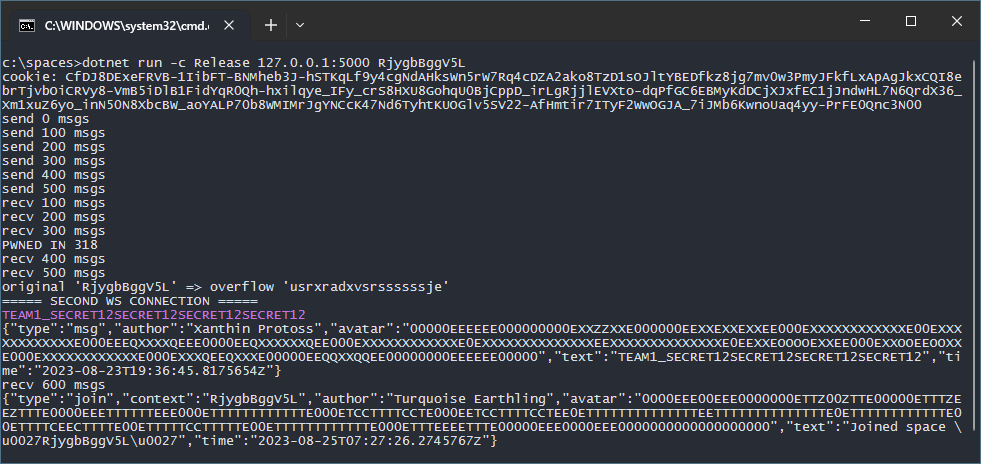

# spaces

**spaces** is the service with anonymous chat spaces and subspaces

API of the service is implemented on websockets, available commands:

* `Generate` - generate random avatar and name before joining space;
* `Join` - join space with a specified ID or generate a new random one;
* `Room` - enter a room with specified NANE in the current space or leave to space root;
* `Close` - close a space to make it private for current participants, no new members are allowed from this moment;
* `Msg` - broadcast a message to all users who are currently in the same space/room;

Users can regenerate a random profile before joining any space. After joining all the participants any member can close the space,
and from this moment no new members can join the closed space and read messages. The current user's space and room are persisted to
the disk, on F5 space and room are read from the disk by the user's auth and the first and last 3 messages are shown.

## Vuln (tldr)

1. Thread-unsafe `Random` instance which can be broken to generate zero space ID
2. Zero space ID encoded as an empty string, not `1` (Base58 zero), and serialized values not padded by `1`
3. An empty encoded space ID leads to a path traversing to the root `data/` folder, which allows us to create a space using `Room` command
4. Base58 implementation is vulnerable to integer overflow on long Base58 strings, which allows us to create conflicting space with the same ID
5. Space open/closed validation uses user passed string not the Int64 decoded Base58 value, so conflicting space instead of real can be used to join

So, the exploitation plan is:

1. Break `Random` instance with a large number of `Generate` requests
2. Generate a new random space, which will be `0` (an empty string after Base58 encoding) because of broken `Random`
3. Create a room with long crafted Base58 string which leads to integer overflow on space ID decoding
4. Save current cookies to reuse websocket connection with saved state with space ID equal to `0`
5. Use the second websocket with crafted Base58 string to join the space and bypass space access checks

## Details

For generation random profiles used a single instance of thread-unsafe PRNG without locks. This instance is also used to
generate a random space ID. The old seeded .NET PRNG implementation uses an [LCG](https://en.wikipedia.org/wiki/Linear_congruential_generator),
this implementation has two counters, and unsynced usage of this instance from multiple threads highly likely leads to
a stable state when both counters become equal. In this state `Random` instance generates only zeros.

Web socket messages are processed in a [multithreaded manner](https://github.com/HITB-CyberWeek/hitbsecconf-ctf-2023/blob/main/services/spaces/src/WsHandler.cs#L53):

    :::cs
    _ = Task.Run(async () =>
    {
        var cmd = JsonSerializer.Deserialize<Command>(/* ... */);
        await conn.ExecuteCommandAsync(cmd, cancel);
    }, cancel);

So if the attacker sends many `Generate` commands without awaiting a response message from the server, it is highly likely that the `Random` instance will be broken.

Space ID is a Base58-encoded Int64 random number. Broken `Random` instance generates only zeroes, and zero encoded as Base58
by **spaces** implementation of Base58 becomes an [empty string](https://github.com/HITB-CyberWeek/hitbsecconf-ctf-2023/blob/main/services/spaces/src/Base58.cs#L17).
**spaces** uses directory structure and files as a storage, all messages of some space are the files inside the directory with
Base58-encoded space ID value. But `Path.Combine` which is used to form a path to files skips empty segments of the path. So if
a broken `Random` instance is used to generate a space ID, the base folder for this space ID is the `data/` folder. This allows
us to manipulate spaces as the rooms which in normal situations lie inside the space base folder.

But the room name validation does not allow us to enter arbitrary space as a room from `data/` folder to read all the messages,
because room names can use only ASCII letters (not digits), and the name is lowercased before further usage whereas space ID's
Base58 alphabet contains also digits and uppercase letters.

Luckily there is another problem: space join validation uses a [user-passed value](https://github.com/HITB-CyberWeek/hitbsecconf-ctf-2023/blob/main/services/spaces/src/WsHandler.cs#L163)
instead of converted to Int64.

    :::cs
    if(value == null)
        Storage.CreateSpace((space = conn.RndSpace()).ToBase58());
    /* user passed string value used to check access here */
    else if(!ContextHelper.TryParseSpace(value, out space) || !Storage.IsSpaceExists(value) || !Storage.HasAccess(value, conn.UserId))
    {
        await conn.TrySendErrorAsync("Space not exists or invalid or closed", cancel);
        return;
    }
    var user = await Storage.FindUserAsync(conn.UserId, space.ToBase58(), cancel);
    /* ... */

That allows us to create a space ID folder which can be used to bypass the real space access checks. Is that possible to generate a Base58 string which will be decoded to the same Int64 value?

Yes, because Base58 implementation contains [integer overflow problem](https://github.com/HITB-CyberWeek/hitbsecconf-ctf-2023/blob/main/services/spaces/src/Base58.cs#L41).

    :::cs
    public static bool TryDecodeUInt64(string value, out ulong result)
    {
        /* ... */
        ulong tmp = 0UL, mul = 1UL;
        for(int i = 0; i < value.Length; i++)
        {
            /* ... */
            tmp += digit * mul;   // <- integer overflow
            mul *= Base;          // <- integer overflow
        } /* ... */
    }

By default C# .NET uses an unchecked context on operations like `+` and `*`. So we can pass a long crafted Base58 string which
will contain only lower ASCII letters and with integer overflows will be decoded to the same Int64 space ID value.

You can see full exploit here: [EXPLOIT](../../../../blob/main/sploits/spaces/Program.cs)

